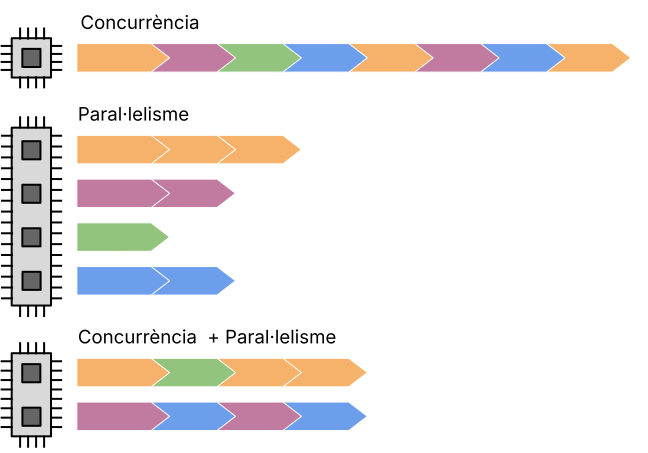

# Concurrència i paral·lelisme

La **concurrència** és la capacitat d'executar diferents parts d'un programa sense un ordre concret, sense que afecte al seu resultat.

Aquesta capacitat concurrent d'un programa, permet la execució en paral·lel de les diferents parts en sistemes multi-processador o multi-core.

El paral·lelisme i la concurrència són dues coses diferents: 
* Un programa paral·lel utilitza diversos nuclis de CPU, cada nucli realitza una tasca de manera independent.
* D'altra banda, la concurrència permet que un programa s'ocupe de múltiples tasques fins i tot en un sol nucli de CPU; el nucli canvia entre tasques (és a dir, fils) sense necessàriament completar cadascuna. Un programa pot tenir ambdues característiques, cap de les dues o una combinació de característiques de paral·lelisme i concurrència.

