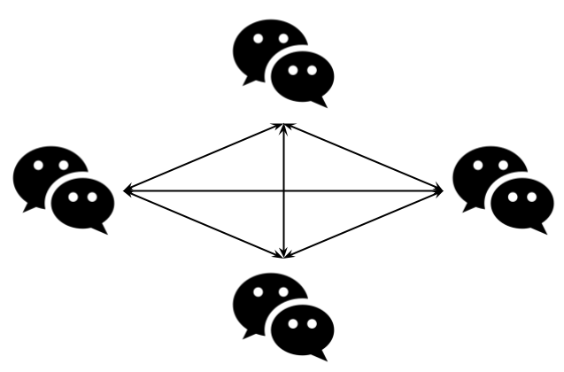

# Virtual Threads

- [Exercicis Virtual threads](#exercicis-virtual-threads)

## Overview

https://docs.oracle.com/en/java/javase/21/core/virtual-threads.html

Un thread es un método que se ejecuta de forma simultánea (_concurrente_ o _paralela_) a otro thread.

La ejecución de métodos de forma simultánea benficia:
* que los programas se ejecuten con más _throughput_ (rendimiento), aprovechando el uso de CPU, ya que en numerosas ocasiones un método se pasa gran parte del tiempo esperando a que finalicen operacion I/O (disco, red, etc...).
* que los programas parezcan más _responsive_ ya que pueden ir avanzando varias tareas poco a poco, en lugar de esperar a que acabe una para empezar otra.
* que los programas sean más rápidos en sisemas multicore, ejecutando los threads en paralelo en los distintos núcleos

Sin embargo, la ejecución de Threads conlleva su problemática, en especial:
* Race conditions: cuando dos threads intentan acceder al mismo recurso (variable) al mismo tiempo, puede llevar a _bugs_ en los que el resultado depende del _timing_ de los threads.
* Deadlocks: si dos threads estan esperandose mútuamente que el otro termine, pueden quedarse atrapados y nunca proceder.
* Starvation: ejecutar diversos threads a la vez puede llevar a _bugs_ de agotamiento de recursos.

Java provee diversos mecanismos para ejecutar Threads y manejar sus problemáticas.

<br />

### 👹 Ejecución de Virtual Threads

#### 🟢 Thread.ofVirtual().start() y Thread.startVirtualThread()

El método `Thread Thread.ofVirtual().start(Runnable task)` permite lanzar la ejecución de un Thread. 

```java
var thread = Thread.ofVirtual().start(() -> {
    // thread code
});
```

De igual manera, el método `Thread Thread.Thread.startVirtualThread(Runnable task)` permite lanzar la ejecución de un Thread.

```java
var thread = Thread.startVirtualThread(() -> {
    // thread code
});
```

Ambos métodos retornan un objeto `Thread` para poder manejar la tarea.

* `join()`:
  
    Espera a que termine el thread. Es importante saber que si no se usa `join()` para esperar que un thread termine, el thread terminará cuando el thread que lo lanzó termine.

    ```java
    var thread = Thread.startVirtualThread(() -> {
        // thread code
        for(int a = 10; a--> 0;) System.out.println(a);
    });
    
    thread.join();  // esperar a que termine el thread
    
    System.out.println("Program finished");
    ```

* `join(long milis)`:
  
    Espera a que termine el thread un tiempo determinado, si el thread no termina el programa continua.

    ```java
    var thread = Thread.startVirtualThread(() -> {
        // thread code
        for(int a = 100000000; a--> 0;) System.out.println(a);
    });
    
    thread.join(1000);  // esperar 1 segundo a que termine el thread
    
    System.out.println("Program finished");
    ```


#### 🟢 Executors.newVirtualThreadPerTaskExecutor() 

Los _Executors_ permiten manejar los threads de una forma más manejable.

El executor _newVirtualThreadPerTask_:

* Debe usarse en un bloque try-with-resources.
* **El executor no se cerrarà hasta que no finalicen todos los threads en ejecución**
* Cada vez que se lanza un thread con `submit()` retorna un objeto `Future` para poder manejarlo.

```java
try (var executor = Executors.newVirtualThreadPerTaskExecutor()) {
    var future = executor.submit(() -> {
        // thread code
    });
}
```

Hay tres variaciones del método `submit()`:

* `<T> Future<T> submit(Callable<T> task)`

    Envía una _tarea-que-retorna-un-resultado_ para su ejecución y devuelve un `Future` que representa el resultado pendiente de la tarea. El método `get` del `Future` retornará el resultado de la tarea una vez completada con éxito.

    ```java
    var future = executor.submit(() -> {
                // thread code
                int a = 0;
                while((a+=++a) < 10);
                return a;  // retorna algun resultado
            }
    );
    
    int result = future.get();   // 15
    ```

* `<T> Future<T> submit(Runnable task, T result)`
    
    Envia una tarea `Runnable` para su ejecución y retorna un `Future` representando dicha tarea. El método `get` del _Future_ retornará el mismo valor `result` que se le proporcionó en la llamada a `submit`. Esto resulta útil para identificar cuál es la tarea que ha finalizado.

    ```java
    var future = executor.submit(() -> {
        // thread code
        // no retorna nada
    }, 1234);

    int result = future.get();   // 1234
    ```

* `Future<?> submit(Runnable task)`

    Envia una tarea `Runnable` para su ejecución y retorna un `Future` representando dicha tarea. El método `get()` del _Future_ retornará `null` cuando se haya completado.

    ```java
    var future = executor.submit(() -> {
        // thread code
        // no retorna nada
    });

    future.get();  // null
    ```

<br />

## Exercicis Virtual threads

<br />

### ⏳ Exercici 1

Escribe un programa que cree dos threads que impriman cada uno un contador en un bucle infinito.

<br /> 

### 🕰 Exercici 2

Se pide desarrollar una aplicación que muestra el tiempo que hace. Los datos los obtenemos de una HTTP API, en concreto:

* https://apipa.vercel.app/api/w/weather
* https://apipa.vercel.app/api/w/temperature
* https://apipa.vercel.app/api/w/wind
* https://apipa.vercel.app/api/w/moon

El problema es que esta API es muuuy utilizada y suele sobrecargarse...

Haz algo para que la aplicación sea algo menos lenta...

```java
import java.io.IOException;
import java.net.URI;
import java.net.URISyntaxException;

public class Apipa {
    public static void main(String[] args) {
        String weather = fetch("https://apipa.vercel.app/api/w/weather");
        String temperature = fetch("https://apipa.vercel.app/api/w/temperature");
        String wind = fetch("https://apipa.vercel.app/api/w/wind");
        String moon = fetch("https://apipa.vercel.app/api/w/moon");

        System.out.println(weather);
        System.out.println(temperature);
        System.out.println(wind);
        System.out.println(moon);
    }

    static String fetch(String url) {
        try(var inputStream = new URI(url).toURL().openStream()) {
            return new String(inputStream.readAllBytes());
        } catch (IOException | URISyntaxException e) {
            throw new RuntimeException(e);
        }
    }
}
```

<br />

### 📺 Exercici 3: Zippeando

El siguiente programa genera un fichero de 100Mb y luego lo comprime en ZIP.

Haz que el programa genere diversos ficheros y luego comprima cada uno de ellos.

Comprueba que si lo hace en distintos _virtual threads_ el proceso dura menos tiempo.

```java
import java.io.IOException;
import java.nio.file.Files;
import java.nio.file.Path;
import java.time.LocalDateTime;
import java.time.temporal.ChronoUnit;
import java.util.concurrent.ThreadLocalRandom;
import java.util.zip.ZipEntry;
import java.util.zip.ZipOutputStream;

public class Main {
    public static void main(String[] args) throws IOException, InterruptedException {
        var start = LocalDateTime.now();

        System.out.println("Generando fichero de 100Mb...");   // recuerda borrarlo !!!!
        generateRandomFile("myfile1", 100_000_000);

        System.out.println("Zipeando fichero...");
        zipFile("myfile1"); // recuerda borrarlo !!!!

        System.out.println("Tiempo tardado: " + ChronoUnit.MILLIS.between(start, LocalDateTime.now()));
    }

    public static void zipFile(String filePath) {
        try (
                var fis = Files.newInputStream(Path.of(filePath));
                var zipOut = new ZipOutputStream(Files.newOutputStream(Path.of(filePath + ".zip")))
        ) {
            zipOut.putNextEntry(new ZipEntry(Path.of(filePath).getFileName().toString()));

            var buffer = new byte[1024];
            int bytesRead;
            while ((bytesRead = fis.read(buffer)) != -1) {
                zipOut.write(buffer, 0, bytesRead);
            }
            zipOut.closeEntry();
        } catch (IOException e) {
            throw new RuntimeException(e);
        }
    }

    static void generateRandomFile(String filePath, int size) {
        try (
                var bw = Files.newBufferedWriter(Path.of(filePath))
        ) {
            ThreadLocalRandom.current().ints(size, 32, 127)
                    .forEach(c -> {
                        try {
                            bw.write(c);
                        } catch (IOException e) {
                            throw new RuntimeException(e);
                        }
                    });
        } catch (IOException e) {
            throw new RuntimeException(e);
        }
    }
}
```

<br />

### ⏰ Exercici 4: Chat P2P



Desarrolla una aplicación de chat peer-to-peer.

El programa tendrá dos partes: servidor y cliente. 
* El servidor irá aceptando conexiones de clientes. Después irá escribiendo los mensajes que lleguen de esas conexiones.
* El cliente tratará permenentemente de conectar con todos los servidores de su red con los que no esté ya conectado. Por otra parte, leerá un mensaje del teclado, y lo enviará a todos los servidores con los que esté conectado.

Usa los siguientes programas como guía:

`Servidor Básico`
```java
import java.io.BufferedReader;
import java.io.IOException;
import java.io.InputStreamReader;
import java.net.ServerSocket;
import java.net.Socket;

public class ChatServer {
    public static void main(String[] args) throws IOException {

        ServerSocket serverSocket = new ServerSocket(7777);
        System.out.println("Servidor iniciado " + serverSocket);

        Socket clientSocket = serverSocket.accept();
        System.out.println("Cliente conectado " + clientSocket);

        var socketReader = new BufferedReader(new InputStreamReader(clientSocket.getInputStream()));

        System.out.println("Esperando mensajes de " + clientSocket + "...");
        socketReader.lines().forEach(System.out::println);

        System.out.println("Servidor parado 🛑");
    }
}
```

`Cliente Básico`
```java
import java.io.IOException;
import java.io.PrintWriter;
import java.net.Socket;
import java.util.Scanner;

public class ChatClient {
    public static void main(String[] args) throws IOException {
        Scanner scanner = new Scanner(System.in);
        
        Socket socket = new Socket("192.168.1.20", 7777);
        System.out.println("Conectado al servidor " + socket);
        
        var socketWriter = new PrintWriter(socket.getOutputStream(), true);

        while (true) {
            System.out.println("Escribe un mensaje:");
            socketWriter.println(scanner.nextLine());
            System.out.println("Mensaje enviado");
        }
    }
}
```

Para intentar conectar con los servidores:
```java
for (int i = 1; i < 50; i++) {
    try {
        System.out.println("Intentando conectar a 192.168.1." + i + "...");
        Socket socket = new Socket("192.168.1." + i, 7777);
        System.out.println("Conectado al servidor " + socket);
    } catch (IOException e) {
        System.out.println("No se pudo conectar al servdor 192.168.1." + i + "...");
    }
}
```


SOLUCION

```java
import java.io.BufferedReader;
import java.io.InputStreamReader;
import java.io.PrintWriter;
import java.net.ServerSocket;
import java.net.Socket;
import java.util.Scanner;

public class Main {
    public static void main(String[] args) throws InterruptedException {

        Thread.startVirtualThread(() -> new Server().start());
        Thread.sleep(1000);
        Thread.startVirtualThread(() -> new Client().start());
    }


    static class Server {
        void start() {
            try {
                ServerSocket serverSocket = new ServerSocket(7777);
                System.out.println("Servidor iniciado " + serverSocket);

                while (true) {
                    Socket clientSocket = serverSocket.accept();
                    System.out.println("Cliente conectado " + clientSocket);
                    Thread.startVirtualThread(() -> {
                        try {
                            var socketReader = new BufferedReader(new InputStreamReader(clientSocket.getInputStream()));

                            System.out.println("Esperando mensajes de " + clientSocket + "...");
                            socketReader.lines().forEach(System.out::println);
                        } catch (Exception _) {
                        }
                    });
                }
            } catch (Exception _) {
            }
        }
    }

    static class Client {
        PrintWriter[] servidores = new PrintWriter[254];

        void start() {
            try {
                Scanner scanner = new Scanner(System.in);

                Thread.startVirtualThread(() -> {
                    try {
                        while (true) {
                            for (int i = 1; i < 255; i++) {
                                if (servidores[i-1] == null) {
                                    Socket socket = new Socket("10.2.1." + i, 7777);
                                    System.out.println("Conectado al servidor " + socket);

                                    var socketWriter = new PrintWriter(socket.getOutputStream(), true);

                                    servidores[i - 1] = socketWriter;
                                }
                            }
                        }
                    } catch (Exception _) {
                    }
                });

                while (true) {
                    System.out.println("Escribe un mensaje:");
                    String mensaje = scanner.nextLine();
                    for(var servidor: servidores) {
                        if (servidor != null) {
                            servidor.write(mensaje);
                        }
                    }
                    System.out.println("Mensaje enviado");
                }
            } catch (Exception _) {
            }
        }
    }
}
```
