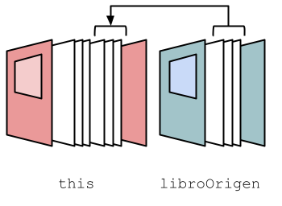

# Lock

- [Exercicis Lock](#exercicis-lock)
  
## Overview

https://docs.oracle.com/javase/tutorial/essential/concurrency/newlocks.html

Los objetos `Lock` tienen el mismo propósito que los bloques `synchronized`, es decir, hacer que un bloque de código no pueda ser ejecutado simultaneamente por dos threads. Solamente el thread que adquiere el `Lock` puede continuar con la ejecución. El resto de threads tienen que
esperar a que **lo libere el thread que lo posee**. 

No obstante, los `Lock` son más sofisticados y tienen dos ventajas:

1. Tienen la posibilidad de que un thread trate de adquirir el `Lock`, si lo consigue puede ejecutar un determinado bloque de código, y si no lo 
consigue puede proseguir su ejecución por otro camino sin quedar bloqueado.

2. Tienen la capacidad de aplicar una política de adquisición que haga un reparto justo, y que de esa forma no sea siempre el mismo thread el que adquiere un `Lock` 


### Crear un Lock

* Sin política de reparto justo:

    ```java
    Lock lock = new ReentrantLock();
    ```

* Con política de reparto justo:

    ```java
    Lock lock = new ReentrantLock(true);
    ```

### Obtener y liberar un Lock

* Obtener

    **La llamada a `lock()` bloquea el thread actual hasta que el lock esté disponible.**

    ```java
    lock.lock();
    ```

* Liberar

    Únicamente puede liberar un lock el thread que lo ha adquirido. Si, un thread trata de liberar un lock que no posee, se lanza una excepción.

    ```java
    lock.unlock();
    ```

### Intentar obtener un Lock

Para intentar obtener un Lock se llama al método `tryLock()` que devuelve `true` o `false`. El thread no se bloquea.

Habitualmente, los threads tratarán de obtener un `Lock` y si lo consiguen ejecutarán un determinado código, y si no lo consiguen, ejecutarán otro (o no harán nada). En cualquier caso, al finalizar liberaran el `Lock` si lo habían conseguido. Este patrón se puede aplicar de la siguiente forma:

```java
boolean lockAdquirido = false;

try {
    lockAdquirido = lock.tryLock();

    if (lockAdquirido){
        // some code
    }
} finally {
    if (lockAdquirido) lock.unlock();
}
```

Este patrón es más útil cuando se realiza el bloque de dos `Lock`:

```java
boolean lock1Adquirido = false;
boolean lock2Adquirido = false;
try {
    lock1Adquirido = lock1.tryLock();
    lock2Adquirido = lock2.tryLock();

    if (lock1Adquirido && lock2Adquirido){
        // some code
    }
} finally {
    if (lock1Adquirido) lock1.unlock();
    if (lock2Adquirido) lock2.unlock();
}
```

También es habitual reintentar los bloqueos hasta que _**ambos**_ estén disponibles.
```java
while(true) {
    boolean lock1Adquirido = false;
    boolean lock2Adquirido = false;
    try {
        lock1Adquirido = lock1.tryLock();
        lock2Adquirido = lock2.tryLock();

        if (lock1Adquirido && lock2Adquirido){
            // some code
            break;
        }
    } finally {
        if (lock1Adquirido) lock1.unlock();
        if (lock2Adquirido) lock2.unlock();
    }
}
```


<br />

## Exercicis Lock

### Exercici 1: 📚 Copybook

El siguiente programa es un gestor de libros. Permite almacenar un libro como una lista de páginas (la primera paǵina es la portada y la última la contraportada). 

Tiene un método `copiarLibro` que recibe un `libroOrigen` y copia todas las páginas de ese libro (menos la portada y contraportada) al final del libro (antes de la contraportada)



```java
import java.util.ArrayList;
import java.util.List;
import java.util.concurrent.Executors;

public class Main {

    static class Libro {
        ArrayList<String> paginas;

        Libro(List<String> paginas) {
            this.paginas = new ArrayList<>(paginas);
        }

        void copiarPaginas(Libro libroOrigen) {
            for (String pagina : libroOrigen.obtenerPaginasInterioresNoVacias()) {
                int penultimaPosicion = Math.max(0, this.paginas.size() - 1);
                this.paginas.add(penultimaPosicion, pagina);
            }
        }

        List<String> obtenerPaginasInterioresNoVacias() {
            List<String> paginas = new ArrayList<>();
            for (String pagina : this.paginas.subList(1, this.paginas.size() - 1)) { // Excluye portada y contraportada
                if(!pagina.isEmpty()) {
                    paginas.add(pagina);
                }
            }
            return paginas;
        }
    }


    public static void main(String[] args) {
        for (int i = 0; i < 100; i++) {
            final Libro libroA = new Libro(List.of("Portada-A", "A1", "A2", "", "A3", "A4", "Contraportada-A"));
            final Libro libroB = new Libro(List.of("Portada-B", "B1", "B2", "B3", "", "B4", "Contraportada-B"));

            try (var executor = Executors.newVirtualThreadPerTaskExecutor()) {
                executor.submit(() -> libroA.copiarPaginas(libroB));
                executor.submit(() -> libroB.copiarPaginas(libroA));
            }

            System.out.println(libroA.paginas);
            System.out.println(libroB.paginas);
            System.out.println();
        }
    }
}
```


