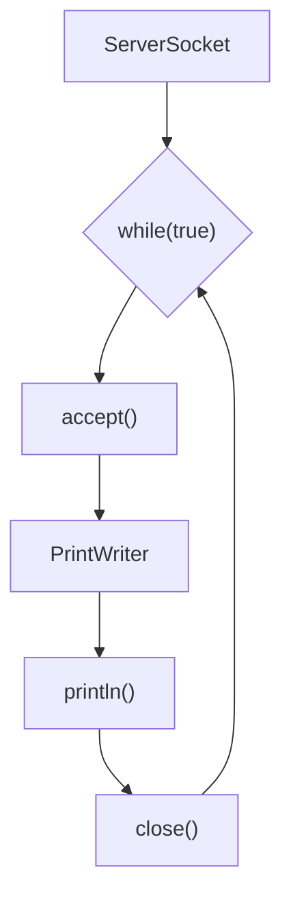
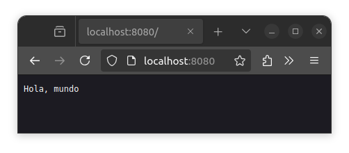
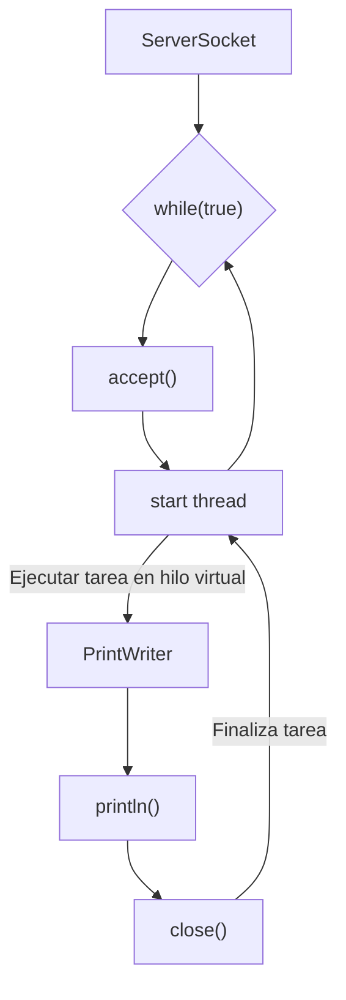
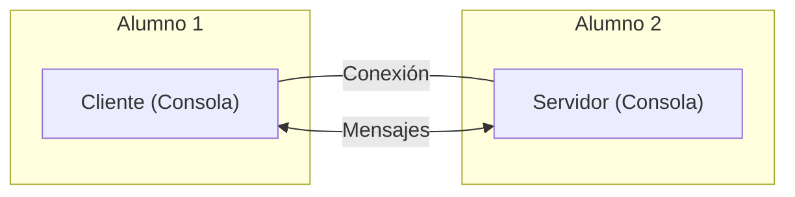
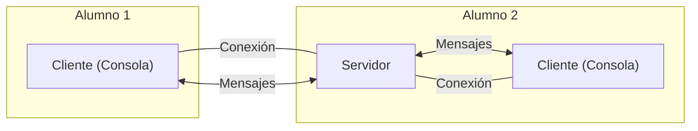
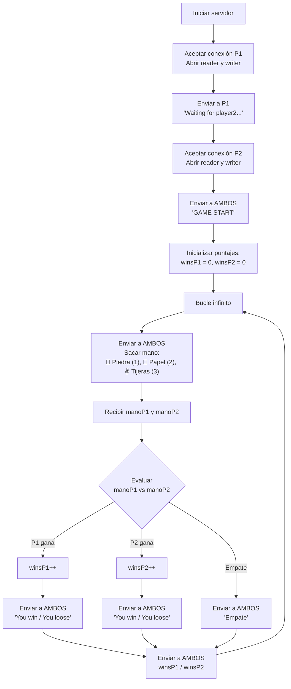
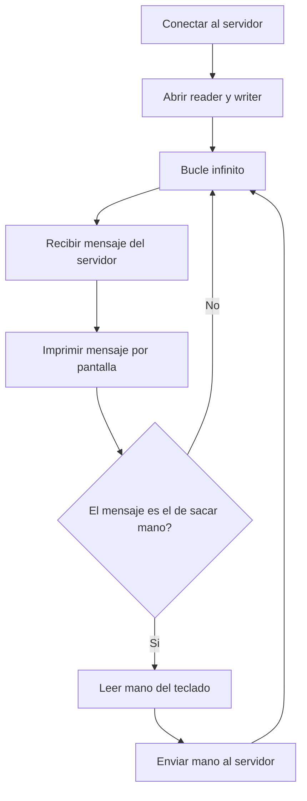
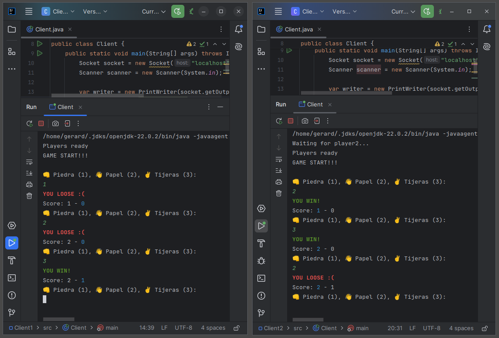

# Cryptography

* [Exercicis Cryptography](#exercicis-cryptography)

## Overview

https://docs.oracle.com/en/java/javase/23/security/java-cryptography-architecture-jca-reference-guide.html


### Base64

```java
// String to byte[]
byte[] bytes = "un texto".getBytes();

// byte[] --> Base64
String enBase64 = Base64.getEncoder().encodeToString(bytes);

// Base64 --> byte[]
byte[] bytes = Base64.getDecoder().decode(enBase64);

```

### 🌐 MessageDigest

```java
String message = "Los datos a hashear";
MessageDigest md = MessageDigest.getInstance("SHA-256");
byte[] hashedBytes = md.digest(message.getBytes());
String hash = Base64.getEncoder().encodeToString(hashedBytes);
```

<br />

### KeyGenerator
```java
KeyGenerator keyGenerator = KeyGenerator.getInstance("AES");
keyGenerator.init(256);
SecretKey secretKey =  keyGenerator.generateKey();
```

### KeyPairGenerator

```java
KeyPairGenerator keyGen = KeyPairGenerator.getInstance("RSA");
keyGen.initialize(2048);
KeyPair keypair = keyGen.generateKeyPair();

PrivateKey privateKey = keypair.getPrivate();
PublicKey publicKey = keypair.getPublic();
```

### 🌐 Signature


```java
byte[] data = "Datos a firmar".getBytes();

// firmar
Signature signature = Signature.getInstance("SHA256withRSA");
signature.initSign(privateKey);
signature.update(data);
byte[] dataSignature = signature.sign();

// validar firma
signature.initVerify(publicKey);
signature.update(data);
boolean valid = signature.verify(dataSignature);
```

<br />

### 🌐 Cipher

Simmetric

```java
PrintWriter socketWriter = new PrintWriter(socket.getOutputStream(), true);
socketWriter.println("This is the data");
```
* *El writer debe ser cerrado cuando se desee finalizar la conexión*.

<br />

### 🌐 Leer datos del socket (recibir)

Para leer líneas de texto de un socket se puede usar un `BufferedReader`, así:

```java
var socketReader = new BufferedReader(new InputStreamReader(socket.getInputStream()));

socketReader.lines();     // Stream<String>
socketReader.readLine();  // String
```

* *El reader debe ser cerrado cuando se desee finalizar la conexión*.

<br />

### 🌐 Conectar a un servidor

Un programa **cliente** puede usar la clase `Socket` para iniciar una conexión con un servidor. Hay diversos constructores; uno de ellos es `Socket(String host, int port)`:

```java
Socket socket = new Socket("15.6.17.18", 7000);
```

Una vez establecida la conexión se pueden usar `PrintWriter` o un `BufferedReader` para comunicarse con el servidor.

* *El socket, el writer y el reader deben ser cerrados cuando se desee finalizar la conexión*.
  
<br />

## Exercicis ServerSocket

### 🦫 Exercici 1: Wait, wait, Firefox

Crea un simple servidor con `ServerSocket` que _repetidamente_ accepte una conexión, envie el texto "Hola, mundo", y cierre la conexión.



Prueba el servidor conectando desde Firefox:



Añade un `sleep` de 5 segundos antes de enviar el texto. Luego, conecta desde dos ventanas de Firefox diferentes y comprueba que la primera ventana tarda unos 5 segundos en recibir la respuesta, y la segunda tarda unos 10 segundos.

<br />

### 🦖 Exercici 2: Wait, Firefox

Añade _multithreading_ al ejercicio anterior. Cuando se acepte la conexión de un cliente, el envío de datos se manejará en un _thread_. 



Comprueba que ahora el segundo cliente no debe esperar 10 segundos a recibir una respuesta.

<br />

### 🦇 Exercici 3: Chat Server <-> Client

Programa un chat, _básico_, con tu compañero de clase. Uno de los dos será el servidor y otro el cliente. Ambos, cliente y servidor, deberéis programar algún tipo de mensaje ✨especial✨, que cuando es recibido envia una respuesta automática.



<br />

### 🦇 Exercici 4: Chat Client <-> Server <-> Client

Programa un chat, _algo menos básico_, con tu compañero de clase. 

Los dos seréis clientes, y os comunicaréis a través de un servidor.



<br />

### 👊👋✌️ Exercici 5: Rock, Paper, Network

Programa el juego Piedra-papel-tijeras en red. 
Dos clientes conectaran a un servidor, e iran enviando sus manos. El servidor comprobara quien gana e irá enviando los resultados.

**Servidor:**



**Clientes:**




