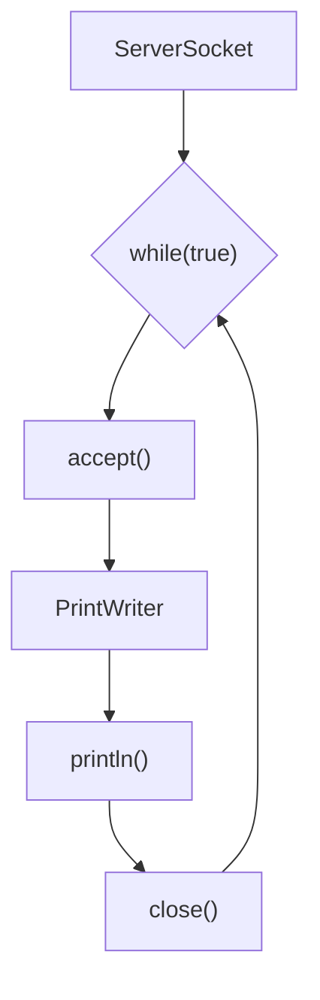
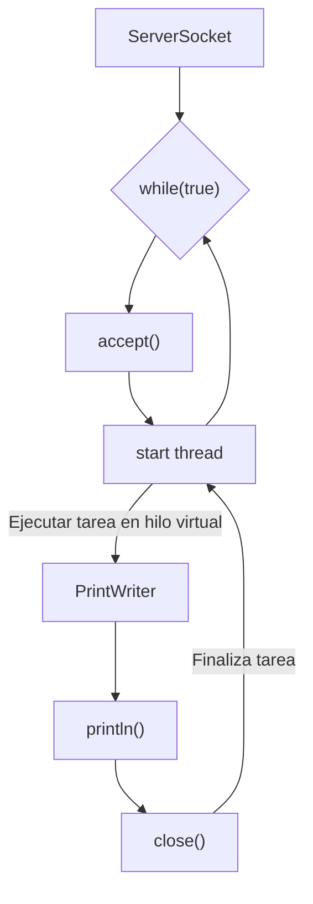
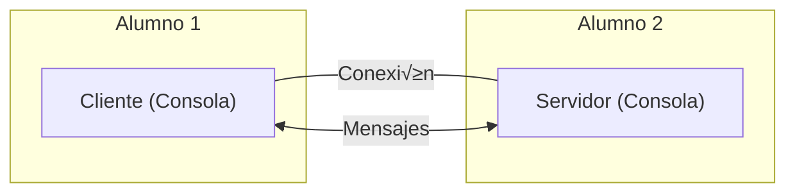
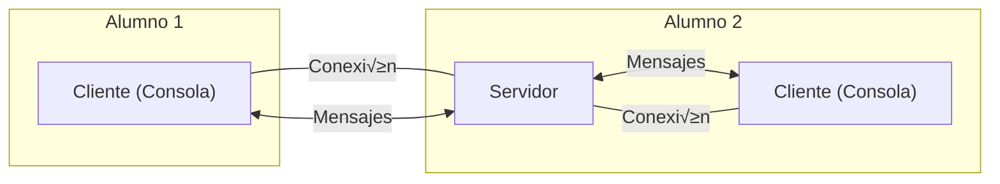
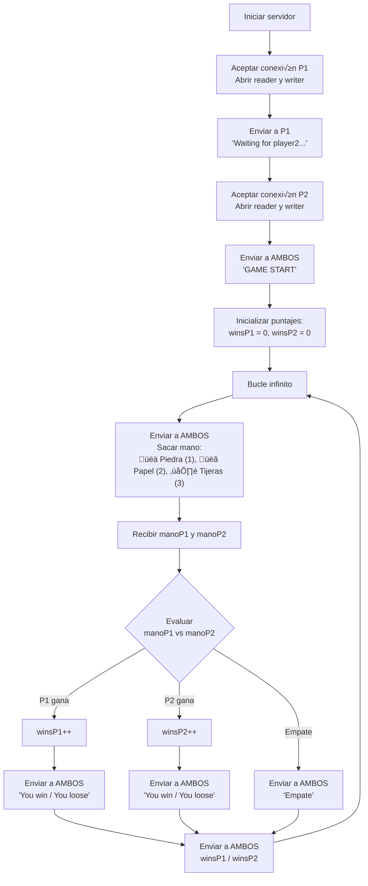
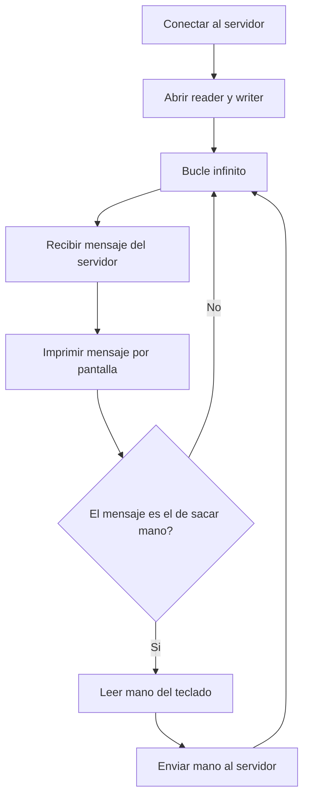

# ServerSocket

* [Exercicis ServerSocket](#exercicis-serversocket)

## Overview

https://docs.oracle.com/en/java/javase/23/docs/api/java.base/java/net/ServerSocket.html

Un socket es un enlace de comunicación bidireccional entre dos programas que ejecutándose en distintas máquinas en una red. 
Cada programa solicita un número de **puerto** al kernel, y de esta forma el kernel conoce a qué programa debe enviar los paquetes, ya que cada paquete lleva asociado un número de puerto al que se envían.

En la arquitectura cliente-servidor, uno de los dos programas hace de servidor: solicita un puerto al kernel, y se queda esperando conexiones de clientes. 
El cliente por su parte, solicita al kernel la conexión con un servidor, y el kernel le asigna un puerto aleatorio.

Para iniciar un servidor en un programa Java se puede usar la clase `java.net.ServerSocket`. Un socket de servidor espera a que lleguen peticiones por la red, y realiza alguna operación en base a dicha petición, retornando possiblemente una respuesta al solicitante.


### üåê Iniciar un servidor

Se crea una instancia de `ServerSocket` pasando el número de puerto solicitado. Si el puerto está en uso lanza una excepción. (Los puertos 1 a 1023 se deben solicitar como _root_).

```java
ServerSocket server = new ServerSocket(8080); 
```

### 🌐 Aceptar una conexión

La llamada al método `accept()` bloquea el programa hasta que llegue una conexión de un cliente. Retorna un objeto `Socket` que se puede usar para recibir o enviar datos.

```java
Socket socket = server.accept();
```

* *El socket debe ser cerrado cuando se desee finalizar la conexión*.

### üåê Escribir datos en el socket (enviar)

Dependiendo del tipo de datos que queramos enviar (bytes, Strings, datos primitivos, objetos, ... ), existen distintos métodos. Para enviar Strings el más común es usar un `PrintWriter`

```java
PrintWriter socketWriter = new PrintWriter(socket.getOutputStream(), true);
socketWriter.println("This is the data");
```
* *El writer debe ser cerrado cuando se desee finalizar la conexión*.

### üåê Leer datos del socket (recibir)

Para leer líneas de texto de un socket se puede usar un `BufferedReader`, así:

```java
var socketReader = new BufferedReader(new InputStreamReader(socket.getInputStream()));

socketReader.lines();     // Stream<String>
socketReader.readLine();  // String
```


### üåê Conectar a un servidor

Un programa **cliente** puede usar la clase `Socket` para iniciar una conexión con un servidor. Hay diversos constructores; uno de ellos es `Socket(String host, int port)`:

```java
Socket socket = new Socket("15.6.17.18", 7000);
```

Una vez establecida la conexión se pueden usar `PrintWriter` o un `BufferedReader` para comunicarse con el servidor.

<br />

## Exercicis ServerSocket

### 🦫 Exercici 1

Crea un simple servidor con `ServerSocket` que _repetidamente_ accepte una conexión, envie el texto "Hola, mundo", y cierre la conexión.


```mermaid
graph TD
    A[ServerSocket] --> B{"while(true)"}
    B --> C["accept()"]
    C --> D[PrintWriter]
    D --> E["println()"]
    E --> F["close()"]
    F --> B
```

Prueba el servidor conectando desde Firefox:


Añade un `sleep` de 5 segundos antes de enviar el texto. Luego, conecta desde dos ventanas de Firefox diferentes y comprueba que la primera ventana tarda unos 5 segundos en recibir la respuesta, y la segunda tarda unos 10 segundos.

<br />

### 🦖 Exercici 2

Añade _multithreading_ al ejercicio anterior. Cuando se acepte la conexión de un cliente, el envío de datos se manejará en un _thread_. 


```mermaid
graph TD
    A[ServerSocket] --> B{"while(true)"}
    B --> C["accept()"]
    C --> D[start thread]
    D -->|Ejecutar tarea en hilo virtual| F["PrintWriter"]
    F --> G["println()"]
    G --> H["close()"]
    H --> |Finaliza tarea| D
    D --> B
```

Comprueba que ahora el segundo cliente no debe esperar 10 segundos a recibir una respuesta.

<br />

### 🦇 Exercici 3

Programa un chat, _básico_, con tu compañero de clase. Uno de los dos será el servidor y otro el cliente. Ambos, cliente y servidor, deberéis programar algún tipo de mensaje ✨especial✨, que cuando es recibido envia una respuesta automática.


```mermaid
graph LR
    subgraph Alumno 1
        A1["Cliente (Consola)"]
    end
    
    subgraph Alumno 2
        B1["Servidor (Consola)"]
    end
    
    A1 ---|Conexión| B1
    B1 <-->|Mensajes| A1
```

<br />

### 🦇 Exercici 4

Programa un chat, _algo menos básico_, con tu compañero de clase. 

Los dos seréis clientes, y os comunicaréis a través de un servidor.


```mermaid
graph LR
    subgraph Alumno 1
        A1["Cliente (Consola)"]
    end
    
    subgraph Alumno 2
        B1[Servidor]

        B2["Cliente (Consola)"]
    end
    
    A1 ---|Conexión| B1
    B1 <-->|Mensajes| A1

    B2 ---|Conexión| B1
    B1 <-->|Mensajes| B2
```

<br />

### 👊👋✌️Rock, Paper, Network

Programa el juego Piedra-papel-tijeras en red. 
Dos clientes conectaran a un servidor, e iran enviando sus manos. El servidor comprobara quien gana e ir√° enviando los resultados.

Servidor:


```mermaid
graph TD
    A[Iniciar servidor] --> B["Aceptar conexión P1<br> Abrir reader y writer"]
    B --> C["Enviar a P1<br>'Waiting for player2...'"]
    C --> D[Aceptar conexión P2<br> Abrir reader y writer]
    D --> E["Enviar a AMBOS<br>'GAME START'"]

    E --> F[Inicializar puntajes:<br> winsP1 = 0, winsP2 = 0]
    F --> G[Bucle infinito]
    G --> H["Enviar a AMBOS<br>Sacar mano:<br>👊 Piedra (1), 👋 Papel (2), ✌️ Tijeras (3)"]
    H --> I[Recibir manoP1 y manoP2]

    I --> J{Evaluar<br>manoP1 vs manoP2}
    J -->|P1 gana| K[winsP1++<br>]
    K --> L[Enviar a AMBOS<br>'You win / You loose'] 
    J --> |P2 gana| M[winsP2++]
    M --> N[Enviar a AMBOS<br>'You win / You loose'] 
    J -->|Empate| O["Enviar a AMBOS<br>'Empate'"]

    L --> P
    N --> P
    O --> P[Enviar a AMBOS<br>winsP1 / winsP2]
    P --> G
```

Clientes:


```mermaid
graph TD
    A[Conectar al servidor] --> B["Abrir reader y writer"]
    B --> C[Bucle infinito]
    C --> D[Recibir mensaje del servidor]
    D --> E[Imprimir mensaje por pantalla]
    E --> F{El mensaje es el de sacar mano?}
    F --> |Si| G[Leer mano del teclado]
    G --> H[Enviar mano al servidor]
    H --> C
    F --> |No| C
```


